# Network

## History & Concepts
* **1965:** تمت أول عملية نقل بيانات في العالم بين جهازين بطريقة **Packet Switching**.
* **Packet Switching:** وهي طريقة تقسيم البيانات إلى قطع صغيرة اسمها **packet**.
* كل **packet** فيها (Mac address بتاع كل من المرسل والمستقبل وقطعة البيانات)، وطبعاً الطريقة دي حصل فيها *data loss*.

عشان العالم بيتطور بسرعة، كنا عايزين طريقة ثانية نوحد بيها نقل البيانات بين الشبكات ونميز كل جهاز، وهنا ظهر معانا **OSI Model**.

---

## OSI (Open Systems Interconnection)

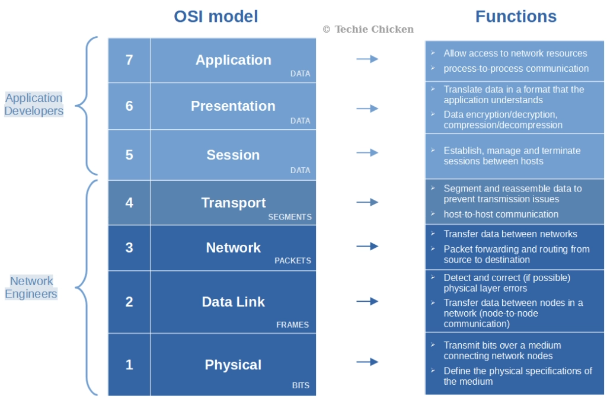

* **OSI:** يوحد طريقة نقل البيانات.

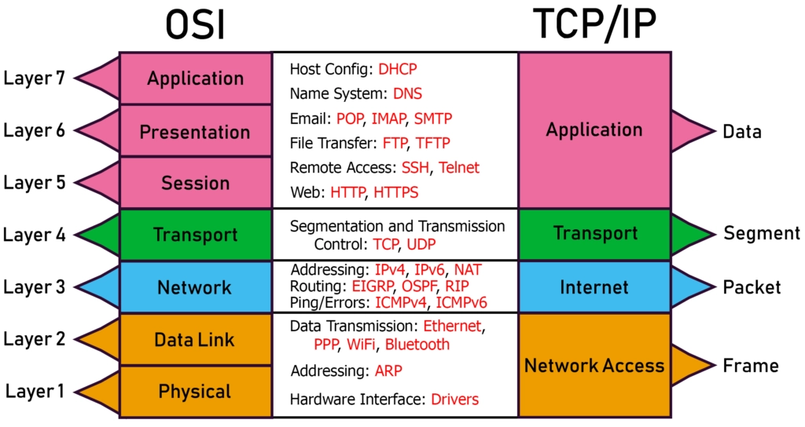

### Encapsulation and Decapsulation
مصطلح مهم جداً معناه **تغليف الداتا**؛ يعني في كل طبقة بضيف حاجة اسمها **Protocol Data Unit (PDU)**، بنضيفها عشان نضمن وصول البيانات للمكان الصح.

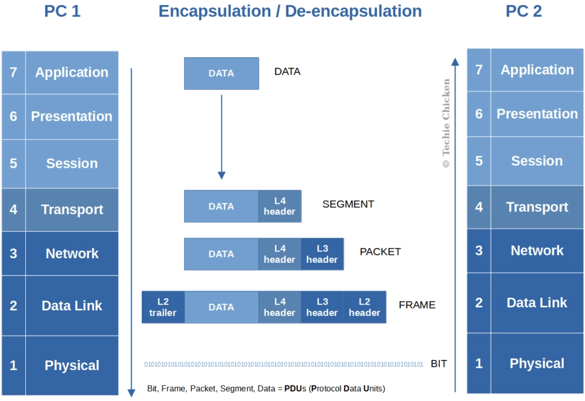

---

## Layers Breakdown

### 7. Application Layer
دي الطبقة اللي بنتفاعل معاها وفيها بروتوكولات مهمة:
* **HTTP/HTTPS:** اللي بيشغل المواقع (Port 80 / 443).

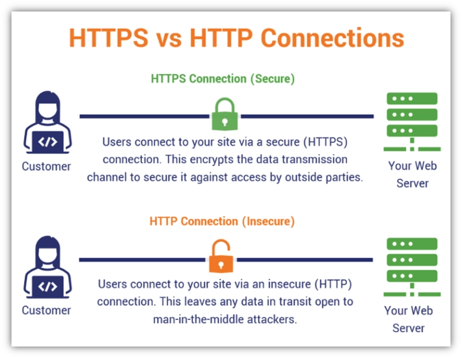

* **DNS:** بيحول اسم الموقع لـ IP.

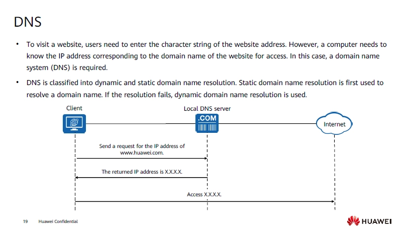

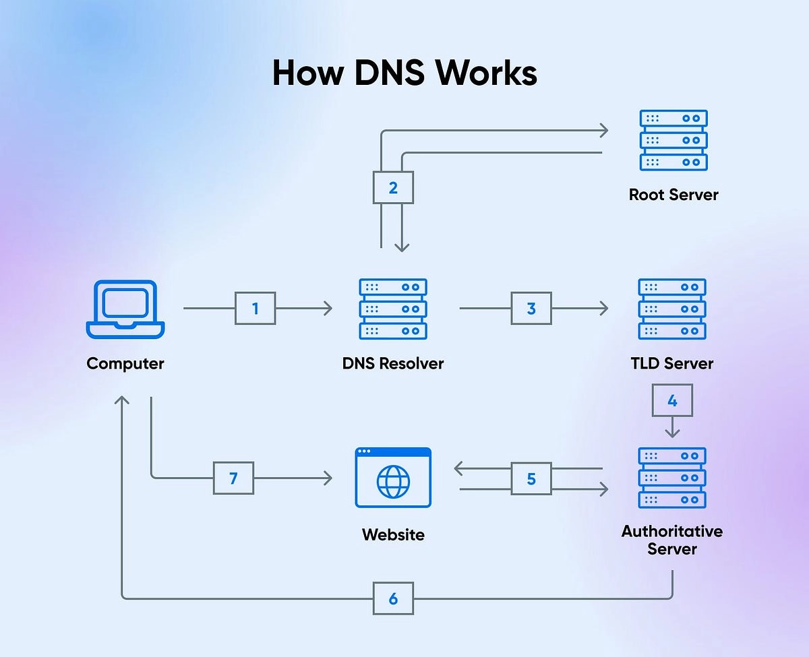

* **DHCP:** بيوزع IP أوتوماتيك لكل جهاز يدخل الشبكة.

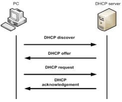

### 6. Presentation Layer
دي الطبقة اللي بتجهز البيانات وتشفرها عشان لما نستخدم بروتوكولات زي HTTPS.

### 5. Session Layer
المسؤولة عن السيشن بين جهازك والسيرفر، بتفتح بـ **3-Way Handshake** ومش بتقفل إلا لما البيانات كلها تتبعت (رايحة جاية وفي الآخر Finish).

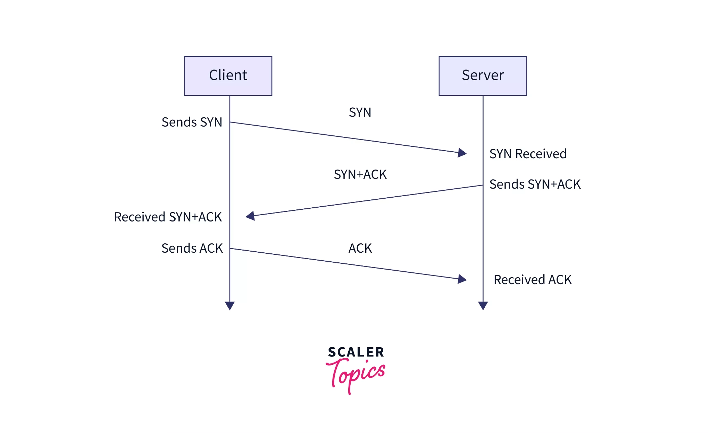

### 4. Transport Layer
بتضمن إن البيانات اتنقلت صح وسليمة، وفيها بروتوكولين مهمين (**TCP**, **UDP**) وبنضيف فيها **Source & Destination Port**.
* **TCP:** بيبعت ويستنى رد، ولو الداتا وقعت يبعتها تاني.

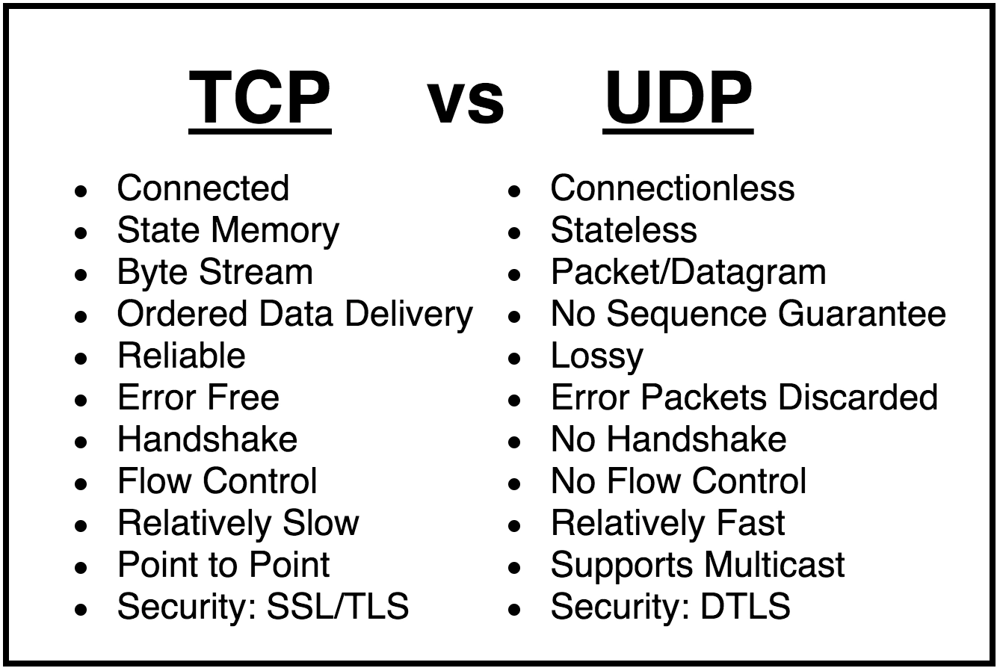

### 3. Network Layer
بتحدد الطريق اللي البيانات هتمشي فيه، وبنضيف فيها **Source & Destination IP**.
* **Network Address:** أول عنوان للتعريف بالشبكة.
* **Broadcast Address:** آخر عنوان لإرسال بيانات للكل.
* **Subnet Mask:** اللي بيفصل بين جزء الـ Network وجزء الـ Host.

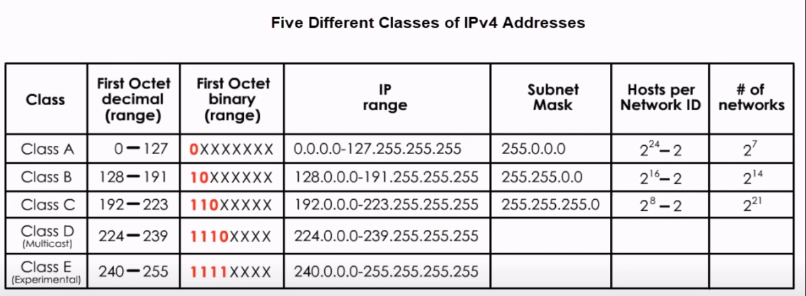
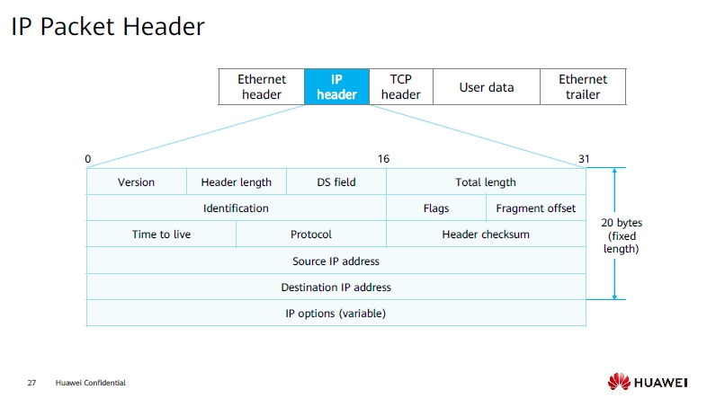

* **IP:** عنوان مميز لكل جهاز.

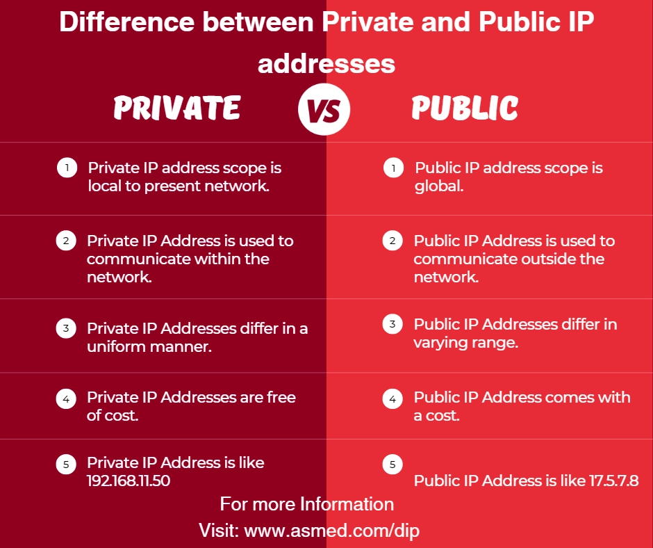

### 2. Data Link Layer
بتجهز البيانات تمشي على السلك جوه الشبكة (LAN)، وبنضيف فيها **Source & Destination MAC Address**، وبتشتغل على مستوى الـ **Switch**.

* **ARP Protocal:** use to convert IP to MAC

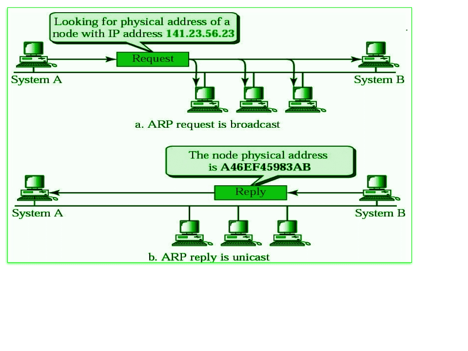

### 1. Physical Layer
آخر طبقة، بتتحول فيها البيانات لـ **0 و 1** (إشارات كهربية أو ضوئية) بتمشي في الكابلات زي **Ethernet** أو **Fiber**.

---

## WEB 

* **URL** 

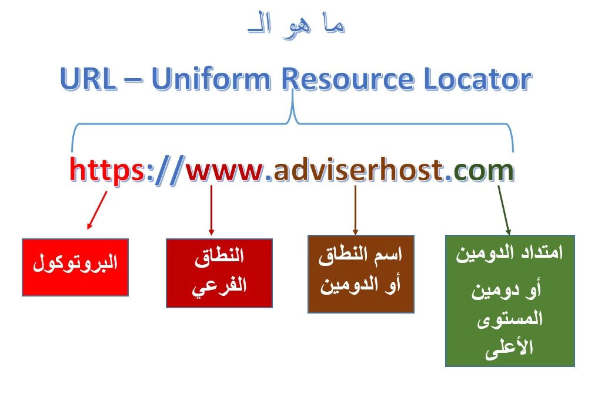

* **HTTP Request Methods:** 

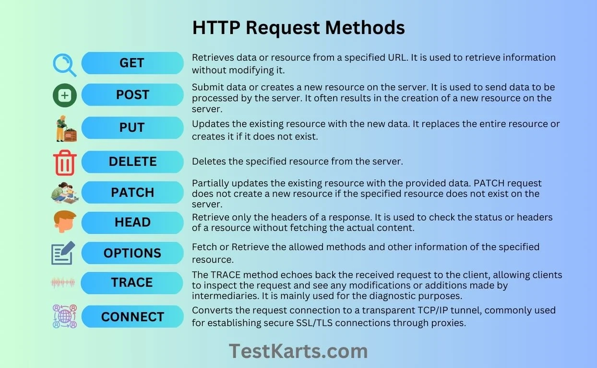

* **HTTP Response:** 

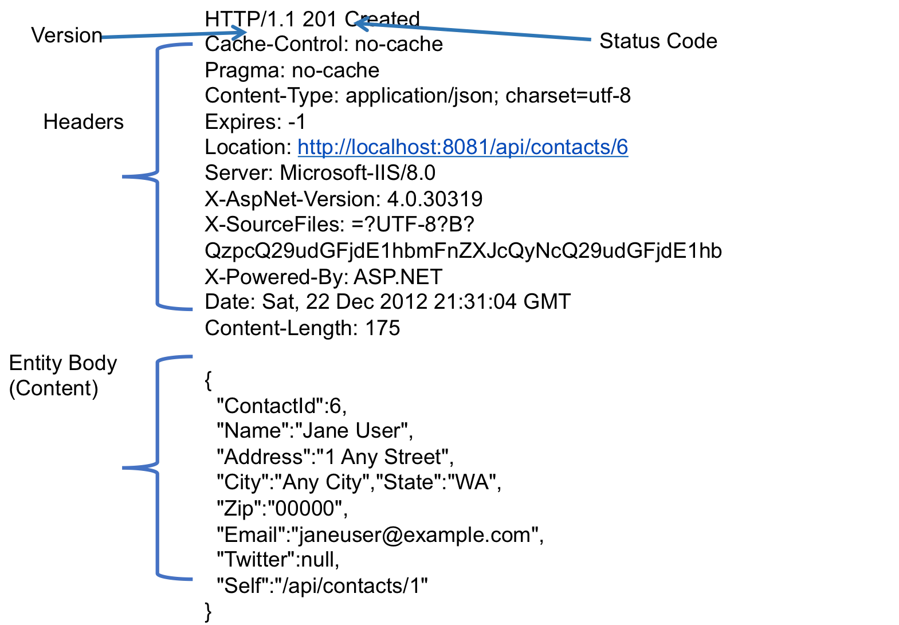

* **HTTP Response Status code:** 

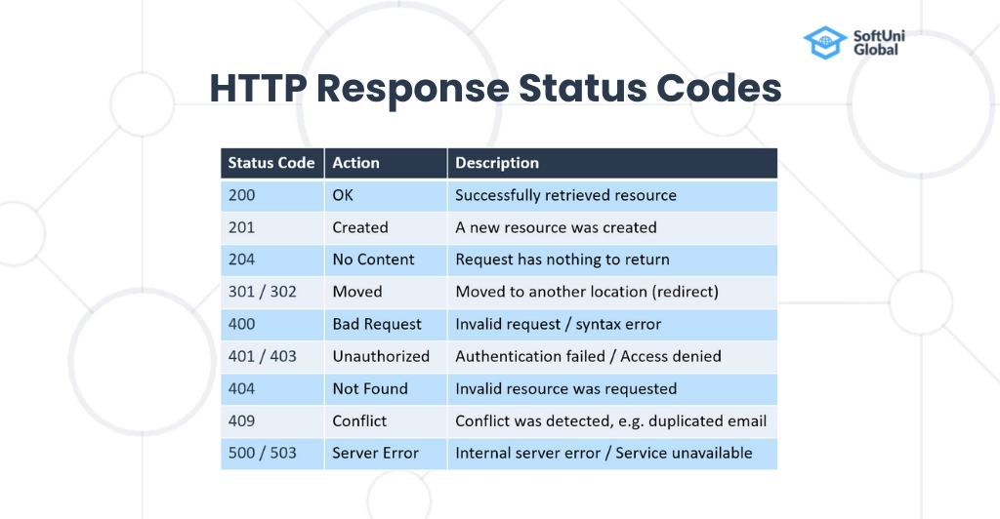

---

## 1. How DNS Works (Step-by-Step Simulation)

    you typed `example.com` in your browser. Here is exactly what happens:

1. **Browser Cache Check:** The browser first looks in its own memory (Local Cache). It thinks: *"Have I visited this site recently?"* If yes, the journey ends here.
2. **OS Cache Check:** If the browser doesn't know, it asks your computer's Operating System (Windows/Mac). The OS checks its **Hosts file** and its own DNS cache.
3. **The Recursor (ISP):** If still not found, your computer asks the **ISP's DNS Recursor**. This server acts like a librarian who will go and find the address for you.
4. **The Root Server:** The Recursor asks the **Root Server**: *"Where is example.com?"* The Root server doesn't know the IP, but it says: *"I know about `.com` websites. Go talk to the **TLD Server** for `.com`."*
5. **The TLD Server (.com):** The Recursor goes to the `.com` TLD (Top-Level Domain) server. This server says: *"I don't have the IP, but I know the **Authoritative Nameserver** for `example.com`. Here is its address."*
6. **The Authoritative Server:** Finally, the Recursor asks the Authoritative server. This server has the "Master Record." It replies: *"Yes! The IP address for `example.com` is `93.184.216.34`."*
7. **Back to Browser:** The Recursor gives the IP to your browser, the browser saves it (Cache), and starts the connection!

---

## The Journey of a Data Packet

### 1. DNS Lookup (The Address Search)

Before any data is sent, the browser needs to find the **IP Address** of the website.

- **Checking the Cache:** The browser first checks its own memory, then the Operating System (OS) cache.
- **DNS Query:** If not found, it asks a **DNS Recursor** (provided by your ISP(Internet Service Provider)).
- **Hierarchy:** The request may go from **Root Nameservers** to **TLD Nameservers** (like `.com`) until it reaches the **Authoritative Nameserver** that holds the IP.

### 2. TCP 3-Way Handshake (Establishing the Connection)

Once the browser has the IP address, it must build a reliable "bridge" to the server using **TCP**:

1. **SYN (Synchronize):** Your computer sends a packet to the server asking to connect.
2. **SYN-ACK (Acknowledge):** The server replies, saying "I am ready."
3. **ACK:** Your computer confirms, and the connection is officially established.

### 3. TLS/SSL Handshake (Securing the Connection)

Because you are using **HTTPS**, the connection must be encrypted via **TLS** to keep data private:

- **Client Hello:** The browser sends its supported encryption methods.
- **Server Hello & Certificate:** The server sends its **Digital Certificate** and **Public Key**.
- **Authentication:** The browser verifies the certificate with a trusted authority.
- **Key Exchange:** Both sides agree on a secret **Session Key**. All data sent from now on is encrypted.

### 4. The Data Journey (OSI Model Layers)

The browser creates an **HTTP Request** (e.g., `GET /index.html`). This request travels down the 7 layers through a process called **Encapsulation**:

1. **Application Layer:** Where the browser and HTTP protocol operate to create the request.
2. **Presentation Layer:** Data is **encrypted** (TLS) and compressed.
3. **Session Layer:** Manages and maintains the connection "session" between you and the server.
4. **Transport Layer:** Data is broken into **Segments**. **TCP** is used here, and **Port 443** (for HTTPS) is assigned.
5. **Network Layer:** Segments are placed into **Packets**. The **Source IP** and **Destination IP** are added.
6. **Data Link Layer:** Packets are placed into **Frames**. The **MAC Address** of the network card and the router are added.
7. **Physical Layer:** Everything is converted into **Bits** (0s and 1s) and sent as electrical, light, or radio signals.

### 5. Receiving Data & Rendering

Once the data reaches the destination (the server or back to your browser), it goes through these final steps:

- **Decapsulation:** The receiver strips away the layers (MAC, IP, TCP) one by one in reverse order (from Layer 1 up to Layer 7) to extract the original data.
- **Rendering:** The browser takes the received files (HTML, CSS, JS) and transforms them into a visual page.

